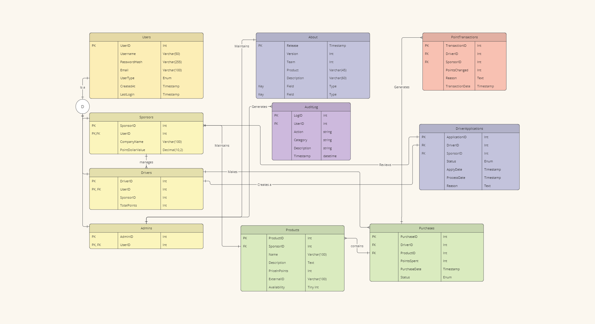
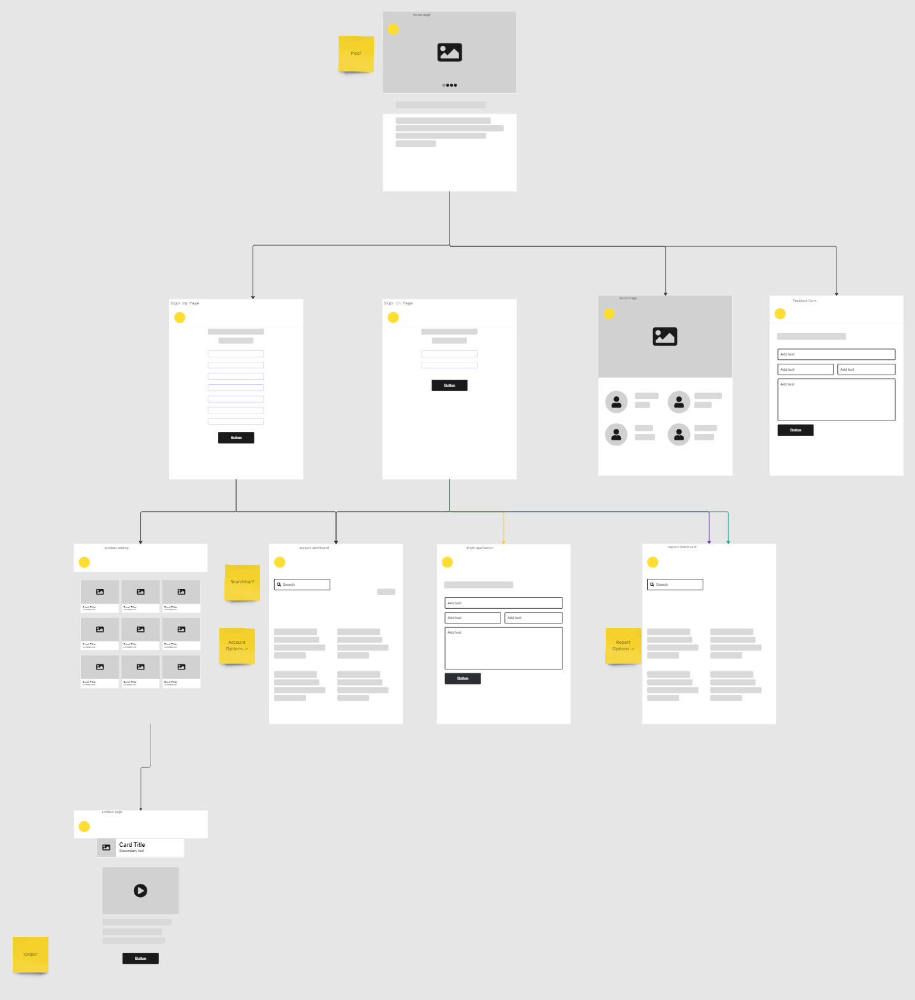

# Project Documentation

## Summary of Tools and Libraries
<!-- not 100% consolidated yet.. -->

### Frontend

**Core Languages**: TypeScript, JavaScript

**Frameworks/Libraries**: React, Tailwind CSS, PostCSS, Axios, Vite

**Build Tools**: Vite (for fast development and optimized builds)

### Backend

**Languages/Frameworks**: C#, ASP.NET Core, Entity Framework Core

**Libraries**: Newtonsoft.Json, Serilog, Swagger

**Databases**: MySQL with support through ORM tools like EF Core

#### Web Server

**NGINX**: Used as a reverse proxy and static file server

**Tools**: Certbot for SSL/TLS

#### Integration

**Node.js**: Utilized for asynchronous tasks, real-time processing, and database integration

## DB ERD

<h1></h1>

## Website Wireframe

<h1></h1>
